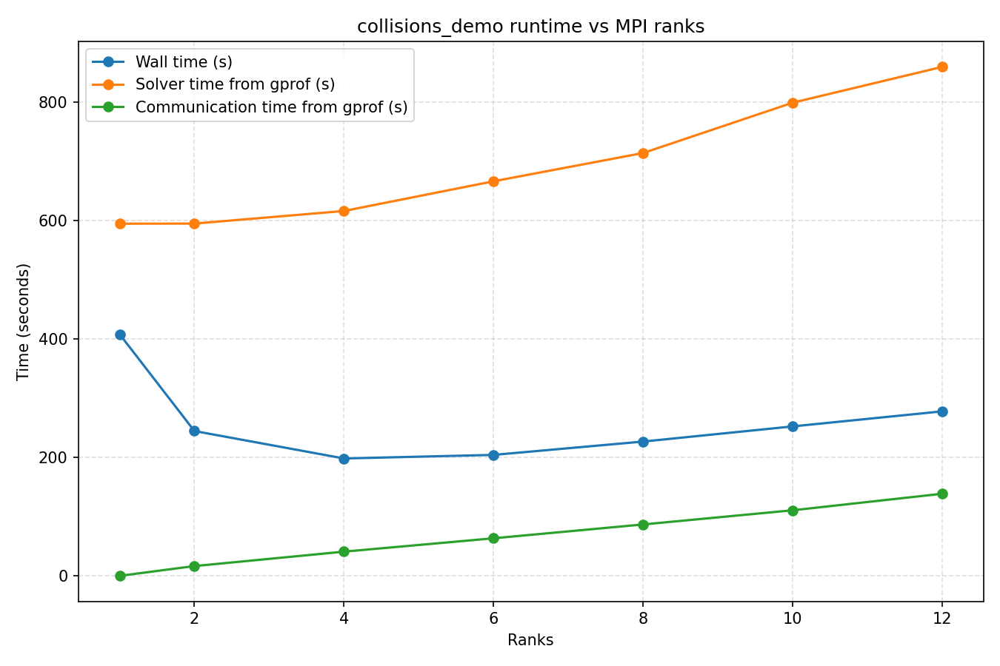

# CardilloMPI

Minimal example how to create a library using CMake with PETSc and Eigen3 dependencies.

## Compile

```bash
mkdir build
cd build
cmake ..
make
```

## Run

```bash
mpirun -np 4 ./examples/example
```

## Benchmark



## Todos
Check why we need to deduplicate contacts in naive_partitioner.cpp.
Adaptive time steps?