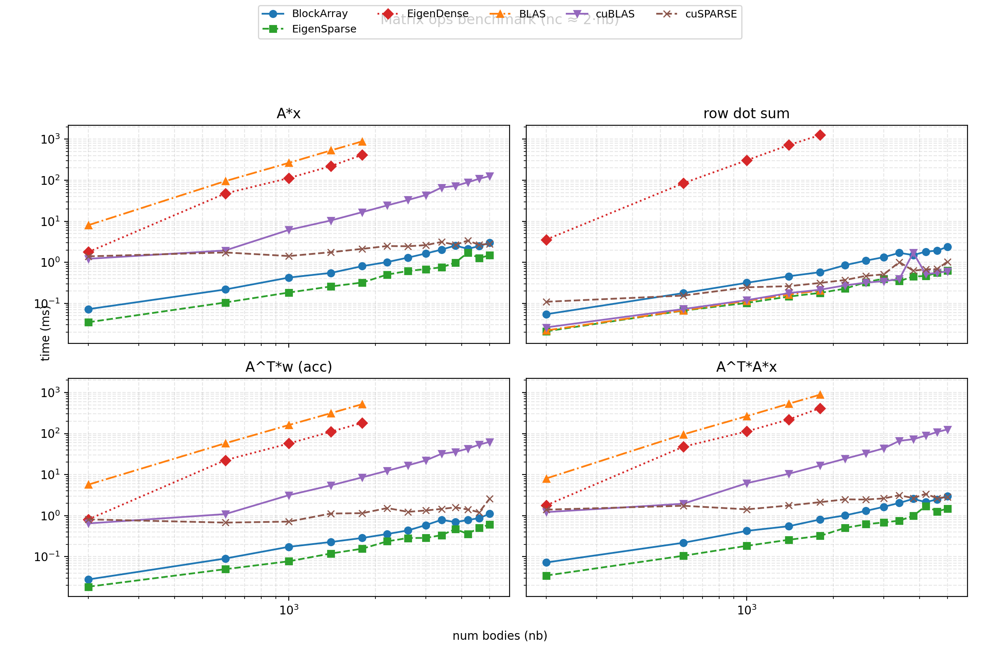

# CardilloMPI

Minimal example how to create a library using CMake with PETSc and Eigen3 dependencies.

## Compile

```bash
mkdir build
cd build
cmake ..
make
```

## Run

```bash
mpirun -np 4 ./examples/example
```

## Benchmark




## Todos
Check why we need to deduplicate contacts in naive_partitioner.cpp.
Adaptive time steps?
Try using PETsc solver and matrices.
Use a bounding volume hierachy for partitioning and broadphase collision detection.
Implement a RigidBody from a mesh, (has its own internal BVH that is instanced and transformed).
Implement friction.
Clean up Collision detection code, make it modular.
Cache the aabb and save them in CollisionObject / CollisionManager.
Warm start the percussive reactions by try to match them to the previous frame impulses.
Implement sleeping for rigid bodies?

## References
https://www.researchgate.net/profile/Dinesh-Manocha/publication/2807460_Collision_Queries_using_Oriented_Bounding_Boxes/links/56cb392008ae5488f0daea80/Collision-Queries-using-Oriented-Bounding-Boxes.pdf